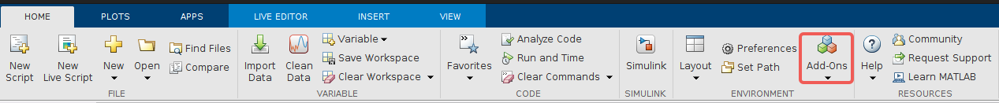
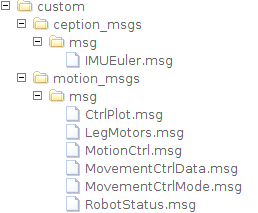
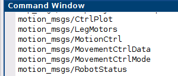
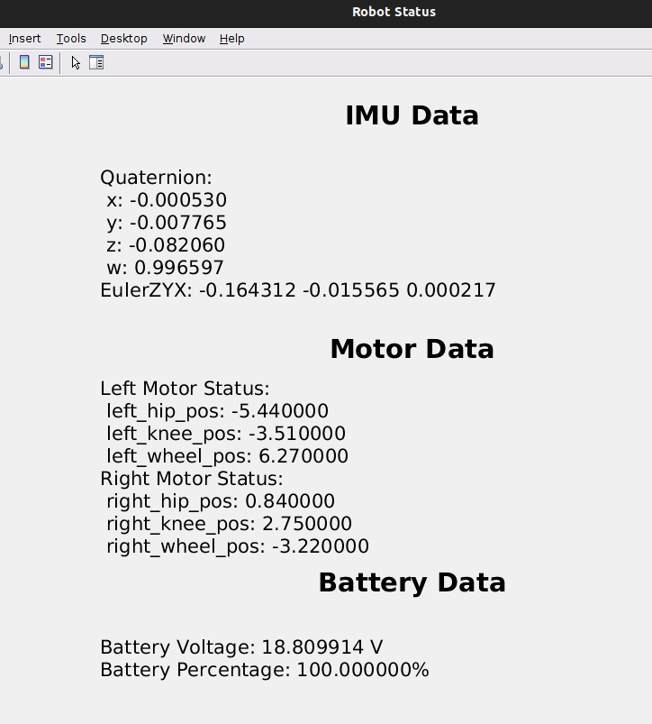
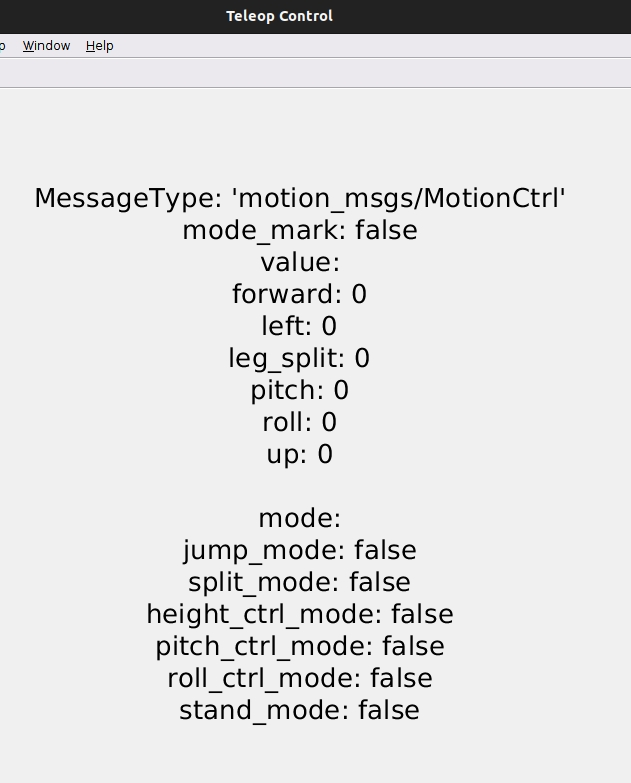
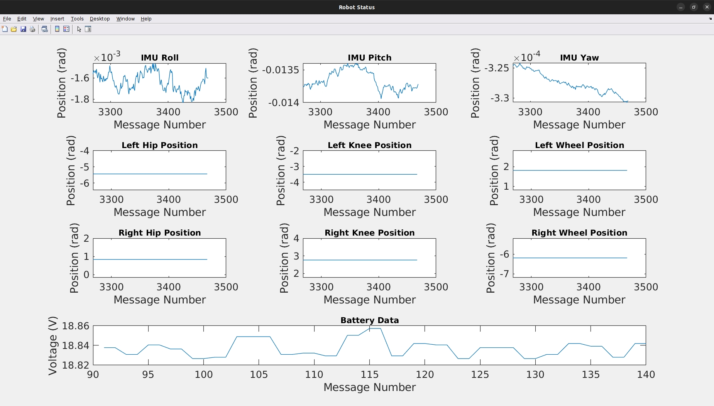

<p align="center"><strong> DIABLO ROS2 -- MATLAB SDK </strong></p>
<p align="center"><a href="https://github.com/DDTRobot/TITA-SDK-ROS2/blob/main/LICENSE"></a>


</p>
<p align="center">
       语言：<a href="/README_CN.md"><strong>中文</strong></a> / <a href="/README_EN.md"><strong>English</strong>
</P>

# Development and Usage Environment
---

DIABLO MATLAB SDK was developed and tested using MATLAB R2022a with the ROS Toolbox. Compatibility with other MATLAB versions may vary and has not been explicitly tested. We recommend using MATLAB R2022a or later version.For a comprehensive list of functions available in the ROS Toolbox and their corresponding compatible MATLAB versions in [ROS Toolbox — Functions](https://ww2.mathworks.cn/help/ros/referencelist.html?type=function&s_tid=CRUX_topnav).

## MATLAB INSTALL ROS Toolbox
MATLAB install

[ROS Toolbox](https://ww2.mathworks.cn/help/ros/index.html?s_tid=CRUX_lftnav)



Click on Add-ons, search for ROS Toolbox, and click Install.
## Configuration
### MATLAB ROS2 Custom Messages
For MATLAB ROS2 custom messages, you can refer to the reference/ROS2CustomMessagesExample.mlx.

Add the messages defined in the [diablo_ros2](https://github.com/DDTRobot/diablo_ros2) to the/custom folder （the file structure is shown below）



Run **diablo_ros2genmsg.m** to specify the folder path of the custom message files, which uses ros2genmsg to create custom messages for MATLAB.

Call ros2 msg list to verify the creation of the new custom messages.

```
ros2 msg list
```




### Configure ROS_DOMAIN_ID

Ensure that the host and robot are connected to the same local area network and have the same DOMAIN ID. Check the robot's DOMAIN ID by opening a terminal and typing

```
echo $ROS_DOMAIN_ID
```

Check the host's ROS2 DOMAIN ID in the MATLAB Command Window

```
getenv("ROS_DOMAIN_ID")
```

If they are different, you can set the DOMAIN ID using the setenv command (for example, set it to 25)

```
setenv("ROS_DOMAIN_ID","25")
```

ROS_DOMAIN_ID configuration is complete.

### Start diablo MATLAB SDK

By default, you have completed the preparation work, for details, please refer to [diablo_ros2](https://github.com/DDTRobot/diablo_ros2)

**Robot** uses the following command to start the diablo sdk

```
ros2 run diablo_ctrl diablo_ctrl_node
```

You can use ros2 node list to view the nodes in the current DOMAIN ID

```
ros2 node list
```

**Note**：You can use the following command to reset ROS_DOMAIN_ID to default
```
 setenv("ROS_DOMAIN_ID","")
```

Now you can start **diablo_teleop_ctrl.m** in MATLAB to control diablo with the keyboard.

**Note:** This routine requires the **Esc** key to exit the virtual remote control.

```text
% w:Control the robot to move forward. (-1.0 ~ +1.0 m/s); (-1.6 ~ +1.6 m/s) Low-speed mode::High-speed mode
% s:Control the robot to move backward. (-1.0 ~ +1.0 m/s); (-1.6 ~ +1.6 m/s) Low-speed mode::High-speed mode
% a:Control the robot to turn left. (-5.0 ~ +5.0 radians/s) Arbitrarily mode
% d:Control the robot to turn right. (-5.0 ~ +5.0 radians/s) Arbitrarily mode
% q: Control the robot to tilt left. (-0.2 ~ +0.2 radians/s) Standing mode
% e:Control the robot to tilt right. (-0.2 ~ +0.2 radians/s) Standing mode
% r:Adjusts the body tilt angle to horizontal. Standing mode
% z:Switches the robot to standing mode.
% x:Switches the robot to crawling mode.
% h:Minimum height in standing mode. Position mode
% k:Medium height in standing mode. Position mode
% j:Maximum height in standing mode. Position mode
% u:Control the robot to pitch up. Position mode
% i:Adjusts the body pitch angle to a horizontal. Position mode
% o:Control the robot to pitch down. Position mode
% f:Spacewalk. dance mode
% g:End spacewalk. dance mode
% Esc:Exits the virtual remote control.
```
**Note:** You can use the clear command to clean up all publishers, subscribers, and nodes.
```matlab
 clear
 % diablo_ception.m
 % clear ImuSub MotorSub BatterySub matlab_diablo_ception_node; 

 % diablo_ception_show.m
 % clear ImuSub MotorSub BatterySub matlab_diablo_ception_show_node;
```
## MATLAB ROS2 Node Directory
1.**diablo_ception.m**（**diablo_ception_show.m** ）uses the matlab_diablo_ception_node (matlab_diablo_ception_show_node) node to subscribe to topics and read IMU, joint motors, hub motors, and battery information, printing it in the command window (figure window). (Use the clear command to stop printing by cleaning up subscribers)


2.**diablo_teleop_node.m** uses the matlab_diablo_teleop_node node to publish topics and control the robot's movement with the keyboard.


3.**diablo_interact.m** uses the matlab_diablo_interact_node node to subscribe and publish topics, drawing real-time robot status information and controlling the robot's movement with the keyboard.

## Reference Materials
Functions in the ROS Toolbox [ROS Toolbox — Functions](https://ww2.mathworks.cn/help/ros/referencelist.html?type=function&s_tid=CRUX_topnav)

DIABLO Robot Secondary Development Control Interface Based on Serial Communication  [diablo_ros2](https://github.com/DDTRobot/diablo_ros2)

[Connect to ROS 2 Network and Establish Communication](https://ww2.mathworks.cn/help/ros/gs/ros2-nodes.html)

 [Versions of Python Compatible with MATLAB Products by Release](https://ww2.mathworks.cn/support/requirements/python-compatibility.html)
